# UML Диаграммы для SmartGrant (Frontend + Backend)

## Содержание

### Frontend диаграммы (1-11)
1. Архитектура приложения
2. Структура данных
3. Zustand Stores
4. API Client Structure
5. User Flow
6. Grant Creation Flow
7. Spending Request Flow
8. File Upload Flow
9. Component Hierarchy
10. State Management Flow
11. Mermaid версии

### Backend диаграммы (12-21)
12. Архитектура бэкенда (FastAPI + PostgreSQL + Smart Contracts)
13. Схема базы данных (PostgreSQL)
14. Поток работы со смарт-контрактами
15. Полный стек (Frontend → Backend → Blockchain)
16. AML Check Flow
17. Backend API Structure
18. Transaction Lifecycle
19. Детальная архитектура бэкенда
20. Интеграция со смарт-контрактами
21. Mermaid - Full Stack Architecture

## 1. Архитектура приложения (Component Diagram)

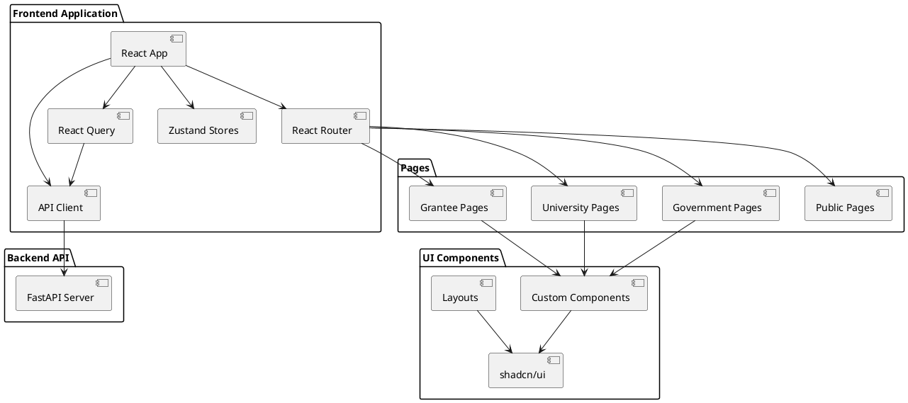

## 2. Структура данных (Class Diagram)

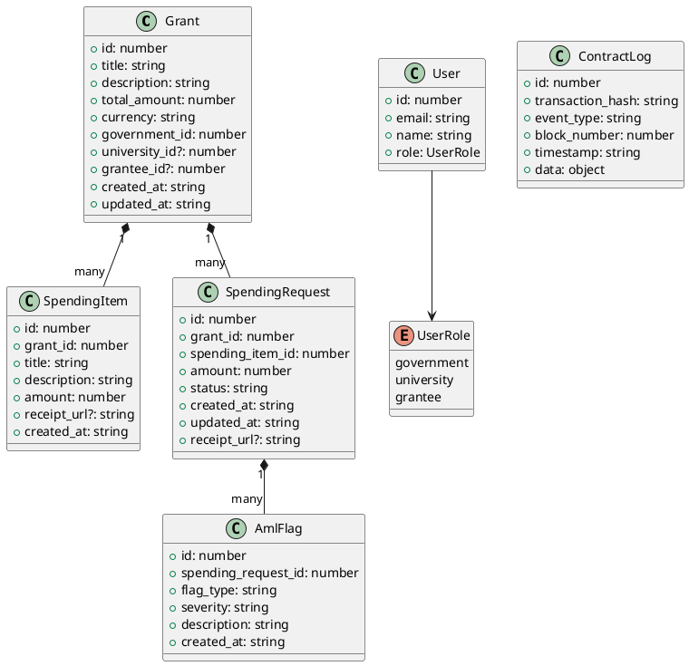

## 3. Структура Zustand Stores (Class Diagram)

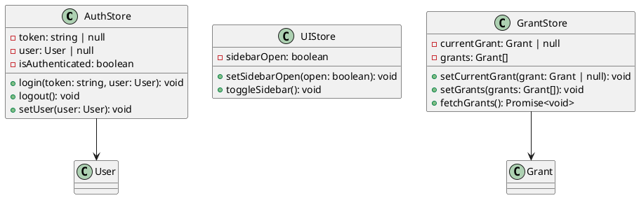

## 4. API Client Structure (Class Diagram)

```plantuml
@startuml APIClient
class ApiClient {
  -baseURL: string
  -headers: object
  +get<T>(url: string): Promise<T>
  +post<T>(url: string, data: any): Promise<T>
  +put<T>(url: string, data: any): Promise<T>
  +delete<T>(url: string): Promise<T>
}

class GrantsAPI {
  +getGrants(): Promise<Grant[]>
  +getGrant(id: number): Promise<Grant>
  +createGrant(data: CreateGrantRequest): Promise<Grant>
  +uploadSpendingItemsFile(grantId: number, file: File): Promise<BulkSpendingItemsResponse>
  +getUniversities(): Promise<University[]>
  +getGrantees(): Promise<Grantee[]>
  +assignGrantee(grantId: number, granteeId: number): Promise<Grant>
}

class SpendingAPI {
  +createSpendingItem(data: CreateSpendingItemRequest): Promise<SpendingItem>
  +createSpendingItems(data: CreateSpendingItemsRequest): Promise<SpendingItem[]>
  +getSpendingItems(grantId: number): Promise<SpendingItem[]>
  +createSpendingRequest(data: CreateSpendingRequestRequest): Promise<SpendingRequest>
  +getSpendingRequest(id: number): Promise<SpendingRequest>
  +getSpendingRequests(): Promise<SpendingRequest[]>
  +approveTop3(requestIds: number[]): Promise<void>
}

class ReceiptsAPI {
  +uploadReceipt(data: UploadReceiptRequest): Promise<ReceiptResponse>
  +uploadSpendingItemReceipt(data: UploadSpendingItemReceiptRequest): Promise<ReceiptResponse>
}

class ContractAPI {
  +getLogs(): Promise<ContractLog[]>
  +getLogsByGrant(grantId: number): Promise<ContractLog[]>
}

class AmlAPI {
  +getFlags(spendingRequestId: number): Promise<AmlFlag[]>
  +getFlagsByGrant(grantId: number): Promise<AmlFlag[]>
}

ApiClient <|-- GrantsAPI
ApiClient <|-- SpendingAPI
ApiClient <|-- ReceiptsAPI
ApiClient <|-- ContractAPI
ApiClient <|-- AmlAPI

@enduml
```

## 5. User Flow (Activity Diagram)

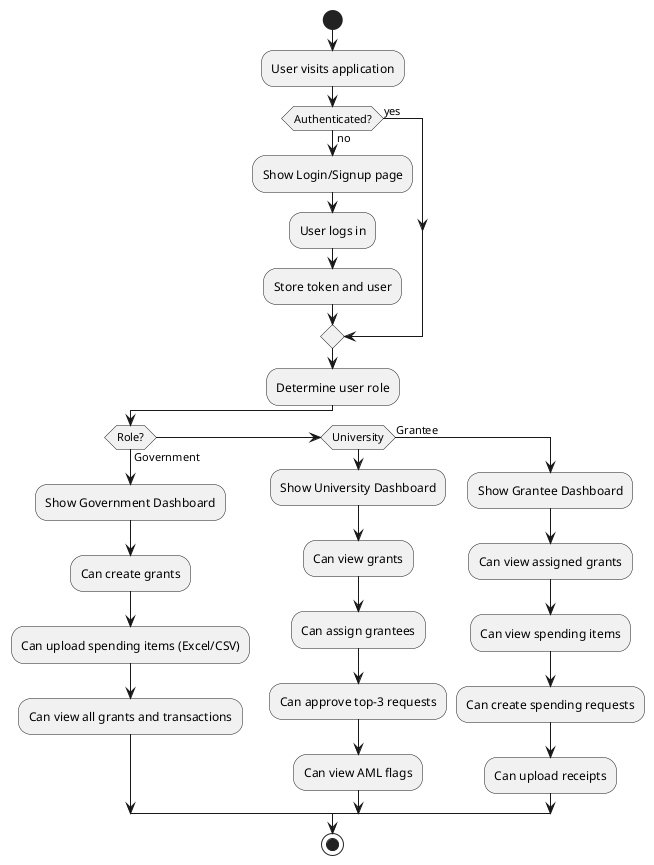

## 6. Grant Creation Flow (Sequence Diagram)

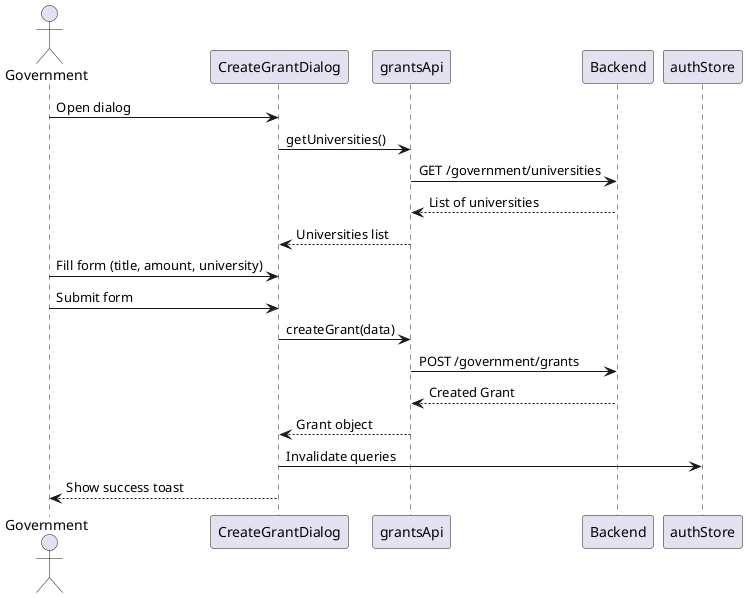

## 7. Spending Request Flow (Sequence Diagram)

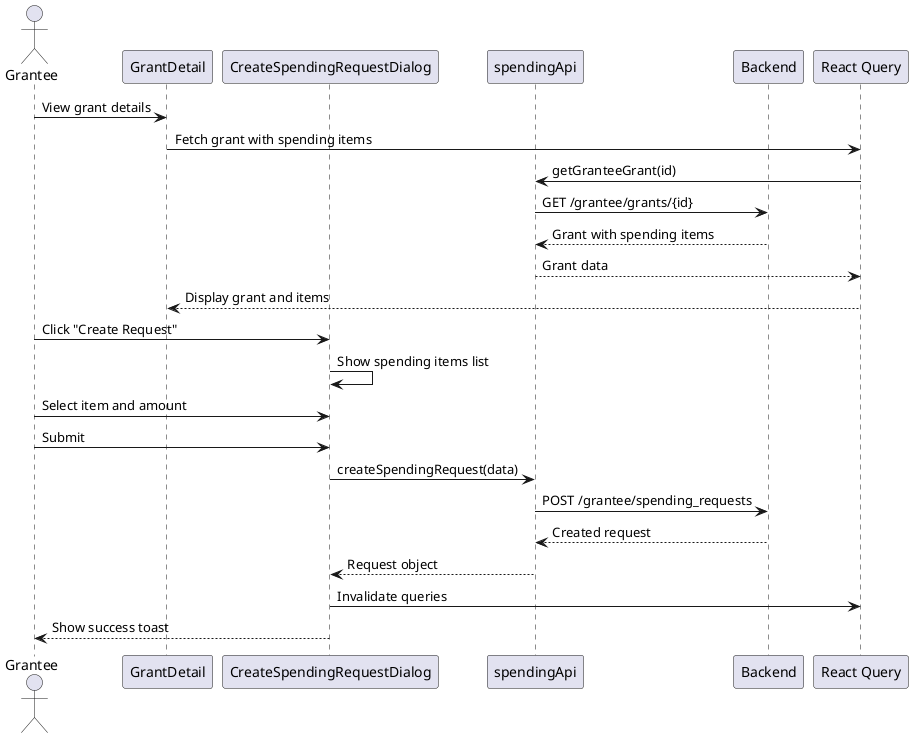

## 8. File Upload Flow (Sequence Diagram)

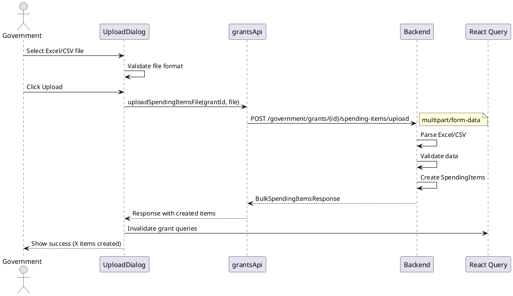

## 9. Component Hierarchy (Component Diagram)

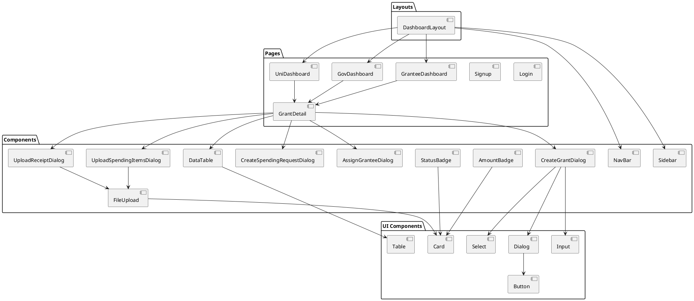

## 10. State Management Flow (State Diagram)

```plantuml
@startuml StateManagement
[*] --> Unauthenticated

state Unauthenticated {
  :Show Login/Signup
}

Unauthenticated --> Authenticated : Login Success

state Authenticated {
  state Government {
    :Can create grants
    :Can upload files
    :Can view all data
  }
  
  state University {
    :Can assign grantees
    :Can approve requests
    :Can view grants
  }
  
  state Grantee {
    :Can view grants
    :Can create requests
    :Can upload receipts
  }
}

Authenticated --> Unauthenticated : Logout

@enduml
```

## 11. Mermaid версия (для GitHub/документации)

### Архитектура приложения

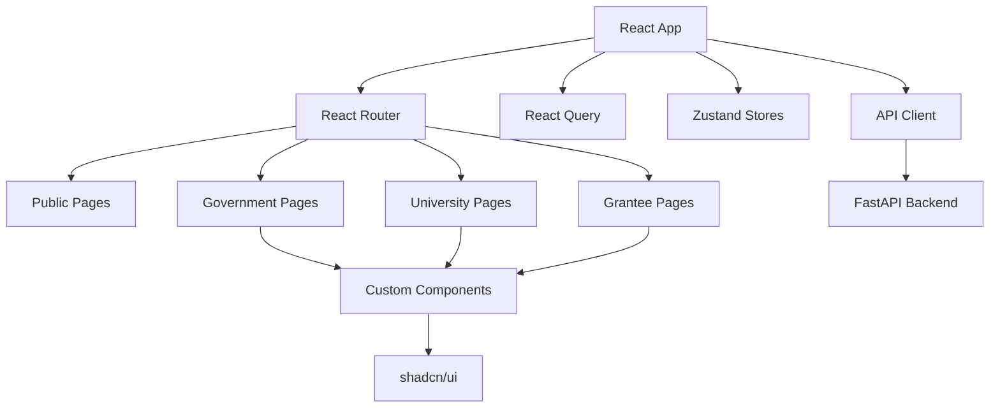

### Структура данных

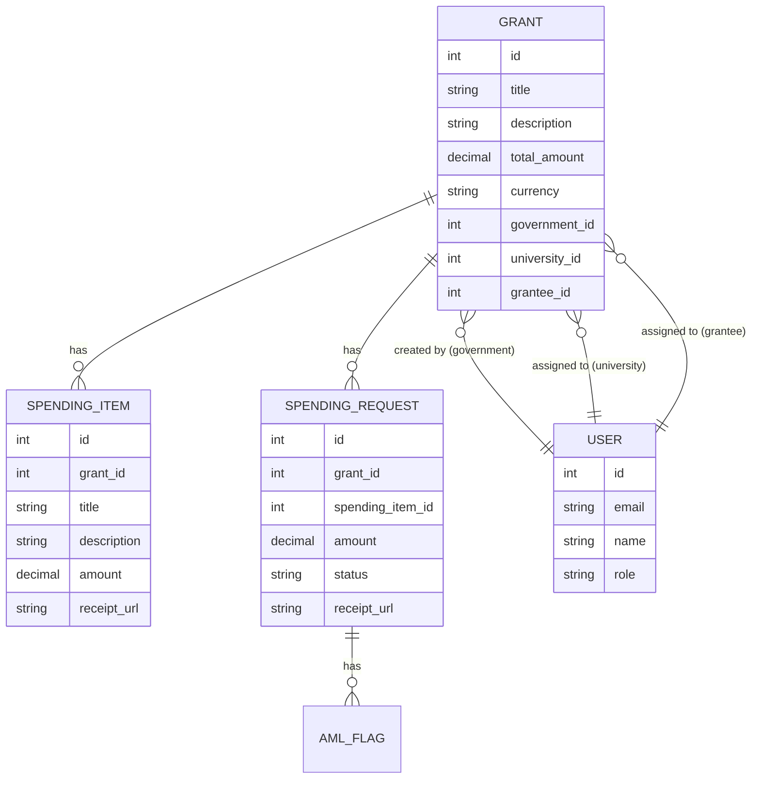

### User Flow


---

# BACKEND ДИАГРАММЫ

## 12. Архитектура бэкенда (Backend Architecture)

```plantuml
@startuml Backend Architecture
!theme plain

package "Frontend" {
  component [React App] as Frontend
}

package "API Layer" {
  component [FastAPI Application] as FastAPI
  component [Authentication Middleware] as Auth
  component [Role-based Access Control] as RBAC
}

package "Business Logic" {
  component [Government Service] as GovService
  component [University Service] as UniService
  component [Grantee Service] as GranteeService
  component [Spending Service] as SpendingService
  component [Contract Service] as ContractService
  component [AML Service] as AmlService
}

package "Smart Contract Integration" {
  component [Web3 Client] as Web3
  component [Mir Pay API Client] as MirPay
  component [Contract Interface] as Contract
  component [Transaction Manager] as TxManager
  component [Event Listener] as EventListener
}

package "Data Layer" {
  database "PostgreSQL" as PG
}

package "Storage" {
  component [File Storage] as Storage
}

Frontend --> FastAPI
FastAPI --> Auth
Auth --> RBAC
RBAC --> GovService
RBAC --> UniService
RBAC --> GranteeService

SpendingService --> Web3
SpendingService --> MirPay
Web3 --> Contract
Web3 --> MirPay
MirPay --> Contract
Contract --> PG
EventListener --> PG
EventListener --> MirPay

Storage --> PG
PG --> FastAPI
FastAPI --> Frontend

@enduml
```

## 13. Схема базы данных PostgreSQL (Database Schema)

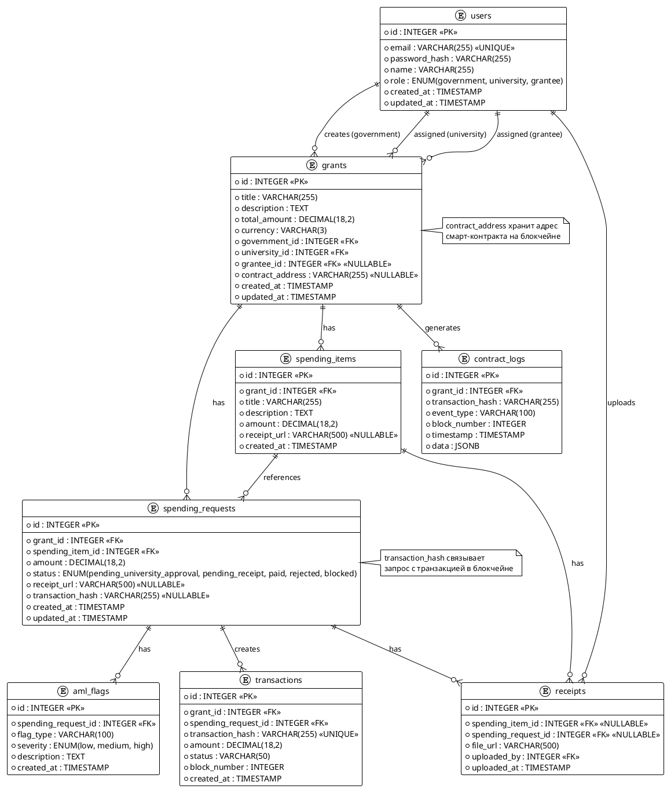

## 14. Поток работы со смарт-контрактами (Smart Contract Flow)

**Описание:** Показывает полный цикл взаимодействия с блокчейном - от создания гранта до выполнения транзакций.

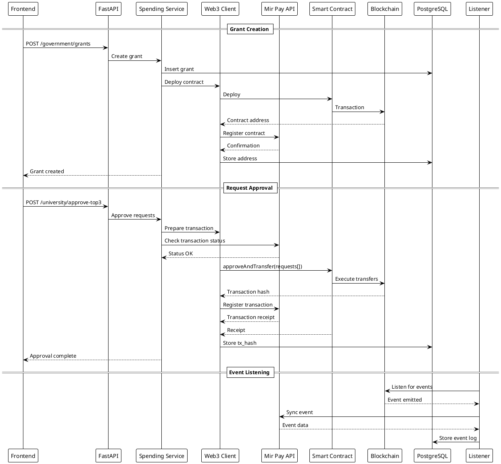

## 15. Полный стек (Full Stack Flow)

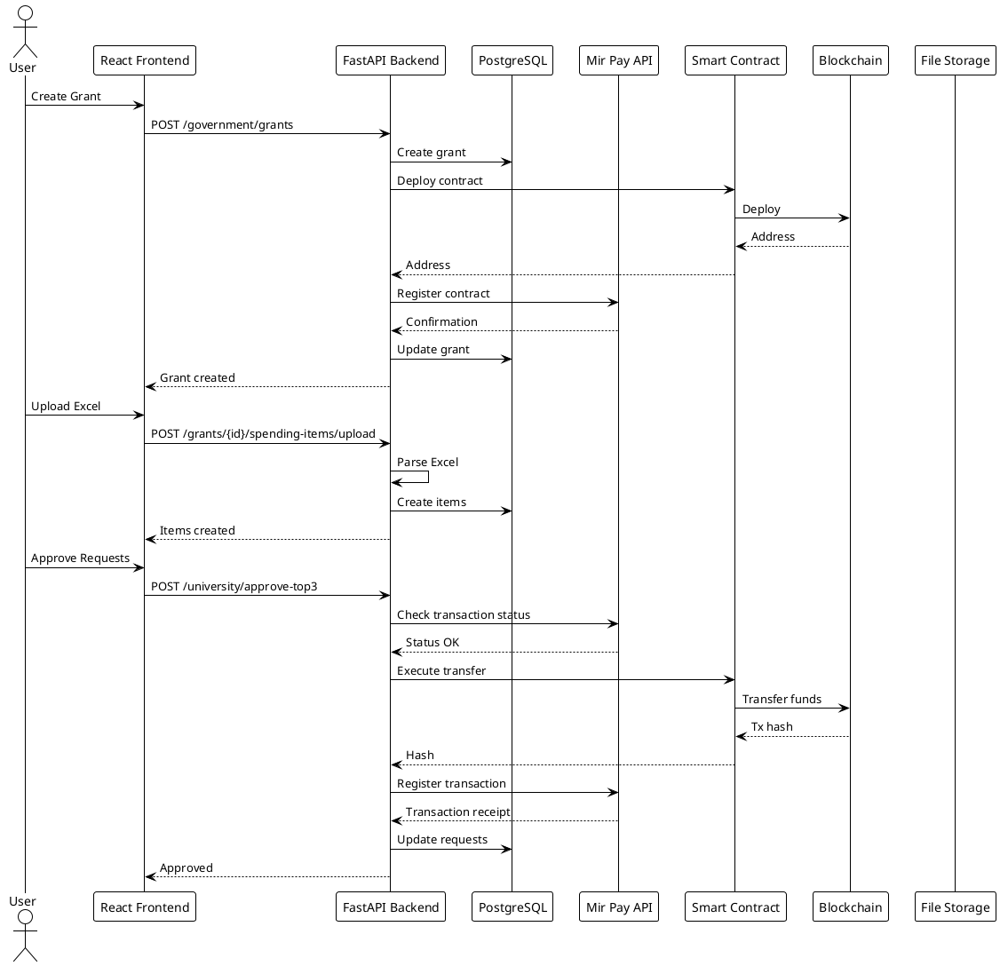

## 16. AML Check Flow (AML проверка)

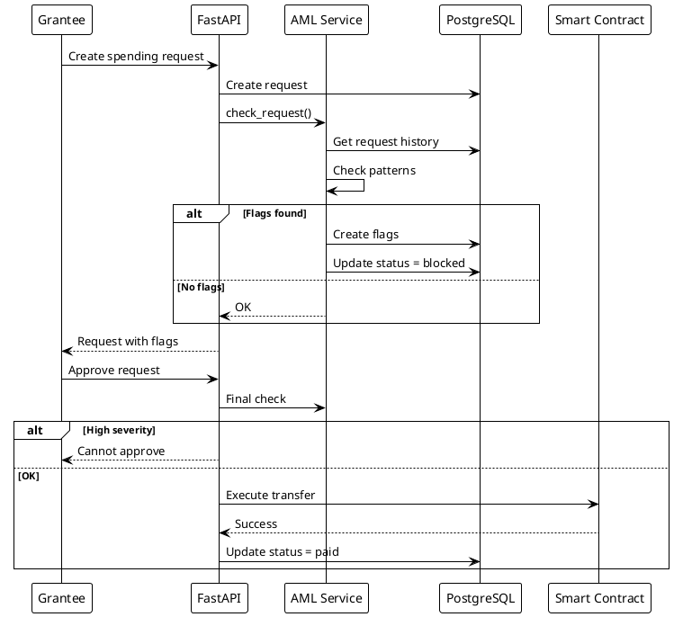

## 17. Backend API Structure (Структура API бэкенда)

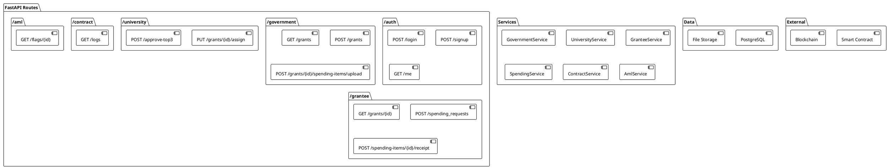

## 18. Transaction Lifecycle (Жизненный цикл транзакции)

```plantuml
@startuml Transaction Lifecycle
!theme plain

state "Request States" {
  [pending_university_approval]
  [pending_receipt]
  [paid]
  [rejected]
  [blocked]
}

[*] --> pending_university_approval

pending_university_approval --> pending_receipt : University approves
pending_university_approval --> rejected : University rejects
pending_university_approval --> blocked : AML high severity

pending_receipt --> paid : Receipt uploaded\n+ Contract executes
pending_receipt --> blocked : AML check fails

paid --> [*]
rejected --> [*]
blocked --> [*]

@enduml
```

## 19. Детальная архитектура бэкенда (Detailed Backend Architecture)

```plantuml
@startuml Backend Detailed Architecture
!theme plain

package "FastAPI Application" {
  [FastAPI App] as FastAPI {
    [CORS Middleware]
    [JWT Middleware]
    [Error Handler]
    [Rate Limiter]
  }
}

package "Services" {
  [Government Service]
  [University Service]
  [Grantee Service]
  [Spending Service]
  [Contract Service]
  [AML Service]
  [Receipt Service]
}

package "Data Access" {
  [SQLAlchemy ORM]
  [Repository Pattern]
}

package "Database" {
  database "PostgreSQL" {
    [Users]
    [Grants]
    [Spending Items]
    [Spending Requests]
    [Receipts]
    [AML Flags]
    [Contract Logs]
  }
}

package "Blockchain" {
  [Web3 Client]
  [Mir Pay API Client]
  [Contract Manager]
  [Transaction Builder]
  [Event Monitor]
  [Smart Contract]
}

package "Storage" {
  [File Storage\nS3/MinIO/Local]
}

FastAPI --> Services
Services --> ORM
ORM --> PostgreSQL
Spending Service --> Web3 Client
Spending Service --> Mir Pay API Client
Web3 Client --> Smart Contract
Mir Pay API Client --> Smart Contract
Receipt Service --> File Storage

@enduml
```

## 20. Интеграция со смарт-контрактами (Smart Contract Integration)

```plantuml
@startuml Smart Contract Integration
!theme plain

package "FastAPI Backend" {
  [Contract Service]
  [Web3 Client]
  [Transaction Queue]
  [Mir Pay API Client]
}

interface "IGrantContract" {
  +approveAndTransfer(requests: Request[]): TransactionHash
  +getBalance(grantId: uint): uint256
  +getRequestStatus(requestId: uint): Status
}

class "GrantContract.sol" {
  -grants: mapping(uint => Grant)
  -requests: mapping(uint => Request)
  -balances: mapping(uint => uint256)
  +approveAndTransfer()
  +getBalance()
  +onTransfer()
  +onApproval()
}

package "Blockchain" {
  [Ethereum/Polygon Network]
  [Transaction Pool]
  [Blockchain State]
}

package "Mir Pay API" {
  [Transaction Status API]
  [Block Explorer API]
  [Account Balance API]
  [Event History API]
  [Gas Price API]
  [Payment Processing API]
}

package "Event System" {
  [Event Listener]
  [Event Parser]
  [Event Storage]
}

Contract Service --> Web3 Client
Contract Service --> Mir Pay API Client
Web3 Client --> Network
Mir Pay API Client --> Transaction Status API
Mir Pay API Client --> Block Explorer API
Mir Pay API Client --> Account Balance API
Mir Pay API Client --> Event History API
Mir Pay API Client --> Gas Price API
Mir Pay API Client --> Payment Processing API

Network --> Event Listener
Event Listener --> Event Storage

note right of GrantContract.sol
  Solidity Smart Contract
  Manages grant funds
  Executes transfers
  Tracks request status
end note

note right of Mir Pay API Client
  Mir Pay API используется для:
  - Проверки статуса транзакций
  - Получения истории событий
  - Мониторинга балансов
  - Получения данных о блоках
  - Оптимизации gas price
  - Обработки платежей
end note

@enduml
```

## 21. Mermaid - Full Stack Architecture

```mermaid
graph TB
    subgraph Frontend
        A[React App] --> B[React Router]
        A --> C[React Query]
        A --> D[Zustand]
        A --> E[Axios Client]
    end
    
    subgraph Backend
        F[FastAPI] --> G[JWT Auth]
        F --> H[RBAC]
        F --> I[Services]
        I --> J[SQLAlchemy]
        J --> K[PostgreSQL]
        I --> L[Web3 Client]
        L --> M[Smart Contract]
        I --> N[File Storage]
    end
    
    subgraph Blockchain
        M --> O[Ethereum/Polygon]
        O --> P[Event Logs]
        P --> Q[Event Listener]
        Q --> K
    end
    
    E --> F
    M --> O
```

## Использование

### PlantUML
1. Установите PlantUML расширение в VS Code
2. Откройте файл с расширением `.puml` или `.plantuml`
3. Диаграммы будут автоматически рендериться

### Mermaid
1. Используйте в Markdown файлах (GitHub поддерживает)
2. Или используйте онлайн редактор: https://mermaid.live/
3. Или установите расширение Mermaid для VS Code

### Онлайн инструменты
- PlantUML: http://www.plantuml.com/plantuml/uml/
- Mermaid: https://mermaid.live/

