# UML Диаграммы для SmartGrant Frontend

## 1. Архитектура приложения (Component Diagram)

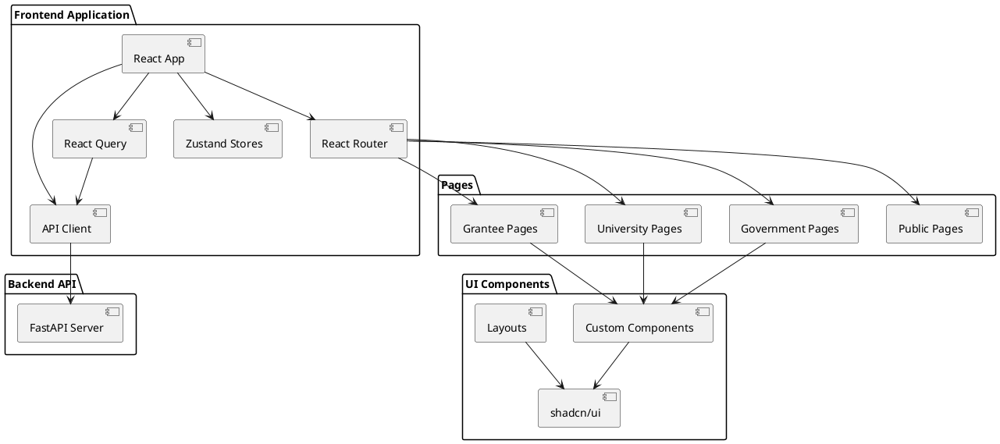

## 2. Структура данных (Class Diagram)

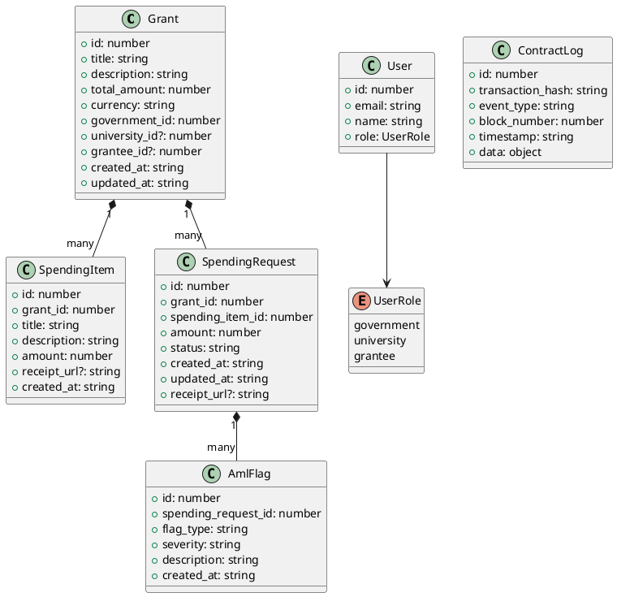

## 3. Структура Zustand Stores (Class Diagram)

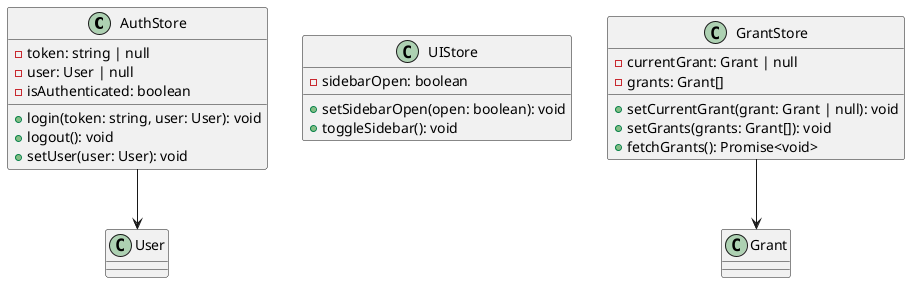

## 4. API Client Structure (Class Diagram)

```plantuml
@startuml APIClient
class ApiClient {
  -baseURL: string
  -headers: object
  +get<T>(url: string): Promise<T>
  +post<T>(url: string, data: any): Promise<T>
  +put<T>(url: string, data: any): Promise<T>
  +delete<T>(url: string): Promise<T>
}

class GrantsAPI {
  +getGrants(): Promise<Grant[]>
  +getGrant(id: number): Promise<Grant>
  +createGrant(data: CreateGrantRequest): Promise<Grant>
  +uploadSpendingItemsFile(grantId: number, file: File): Promise<BulkSpendingItemsResponse>
  +getUniversities(): Promise<University[]>
  +getGrantees(): Promise<Grantee[]>
  +assignGrantee(grantId: number, granteeId: number): Promise<Grant>
}

class SpendingAPI {
  +createSpendingItem(data: CreateSpendingItemRequest): Promise<SpendingItem>
  +createSpendingItems(data: CreateSpendingItemsRequest): Promise<SpendingItem[]>
  +getSpendingItems(grantId: number): Promise<SpendingItem[]>
  +createSpendingRequest(data: CreateSpendingRequestRequest): Promise<SpendingRequest>
  +getSpendingRequest(id: number): Promise<SpendingRequest>
  +getSpendingRequests(): Promise<SpendingRequest[]>
  +approveTop3(requestIds: number[]): Promise<void>
}

class ReceiptsAPI {
  +uploadReceipt(data: UploadReceiptRequest): Promise<ReceiptResponse>
  +uploadSpendingItemReceipt(data: UploadSpendingItemReceiptRequest): Promise<ReceiptResponse>
}

class ContractAPI {
  +getLogs(): Promise<ContractLog[]>
  +getLogsByGrant(grantId: number): Promise<ContractLog[]>
}

class AmlAPI {
  +getFlags(spendingRequestId: number): Promise<AmlFlag[]>
  +getFlagsByGrant(grantId: number): Promise<AmlFlag[]>
}

ApiClient <|-- GrantsAPI
ApiClient <|-- SpendingAPI
ApiClient <|-- ReceiptsAPI
ApiClient <|-- ContractAPI
ApiClient <|-- AmlAPI

@enduml
```

## 5. User Flow (Activity Diagram)

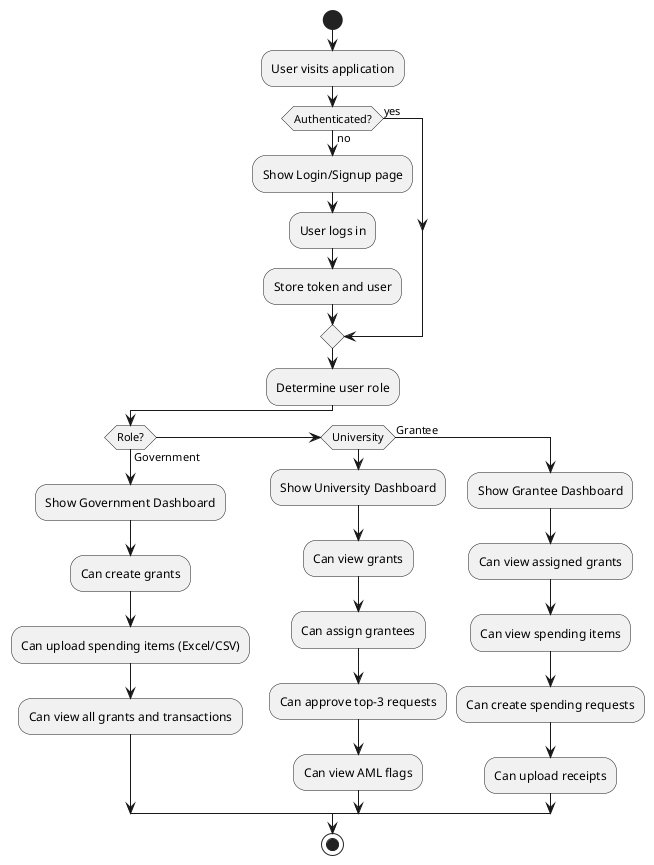

## 6. Grant Creation Flow (Sequence Diagram)

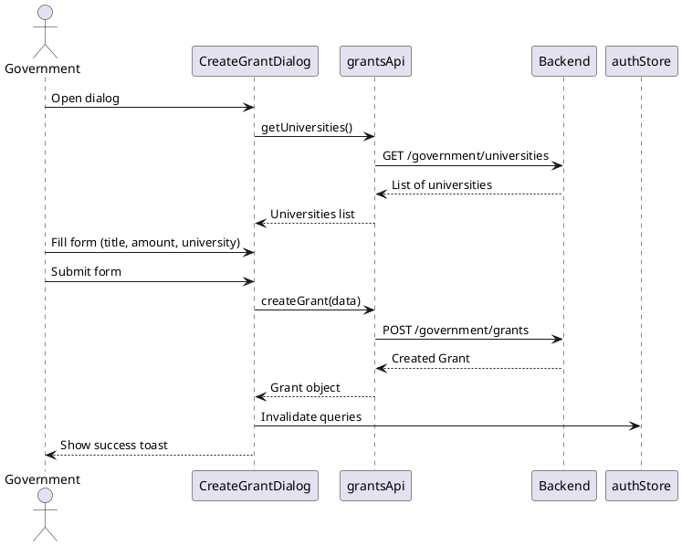

## 7. Spending Request Flow (Sequence Diagram)

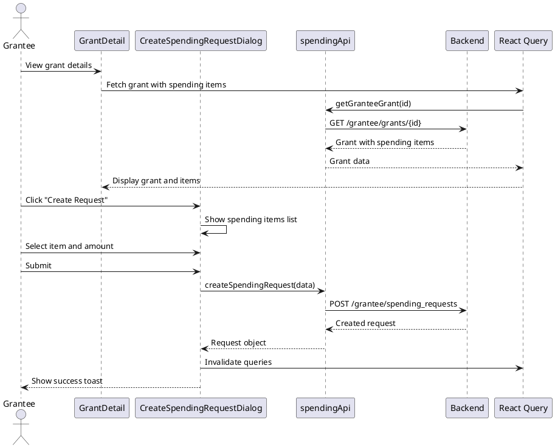

## 8. File Upload Flow (Sequence Diagram)

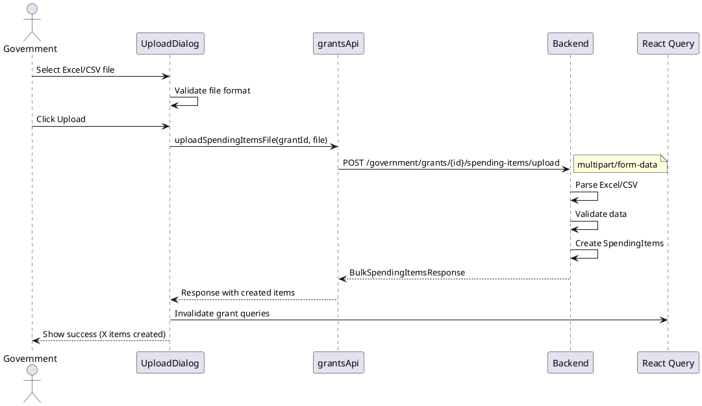

## 9. Component Hierarchy (Component Diagram)

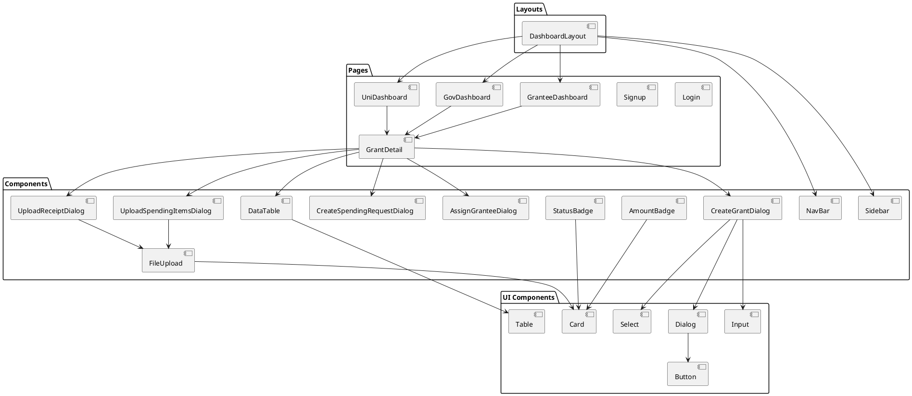

## 10. State Management Flow (State Diagram)

```plantuml
@startuml StateManagement
[*] --> Unauthenticated

state Unauthenticated {
  :Show Login/Signup
}

Unauthenticated --> Authenticated : Login Success

state Authenticated {
  state Government {
    :Can create grants
    :Can upload files
    :Can view all data
  }
  
  state University {
    :Can assign grantees
    :Can approve requests
    :Can view grants
  }
  
  state Grantee {
    :Can view grants
    :Can create requests
    :Can upload receipts
  }
}

Authenticated --> Unauthenticated : Logout

@enduml
```

## 11. Mermaid версия (для GitHub/документации)

### Архитектура приложения

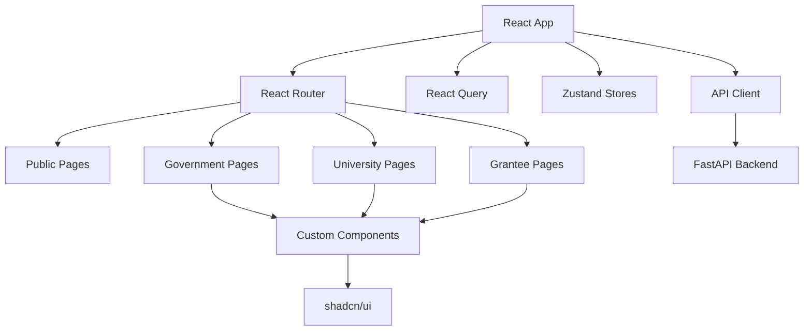

### Структура данных

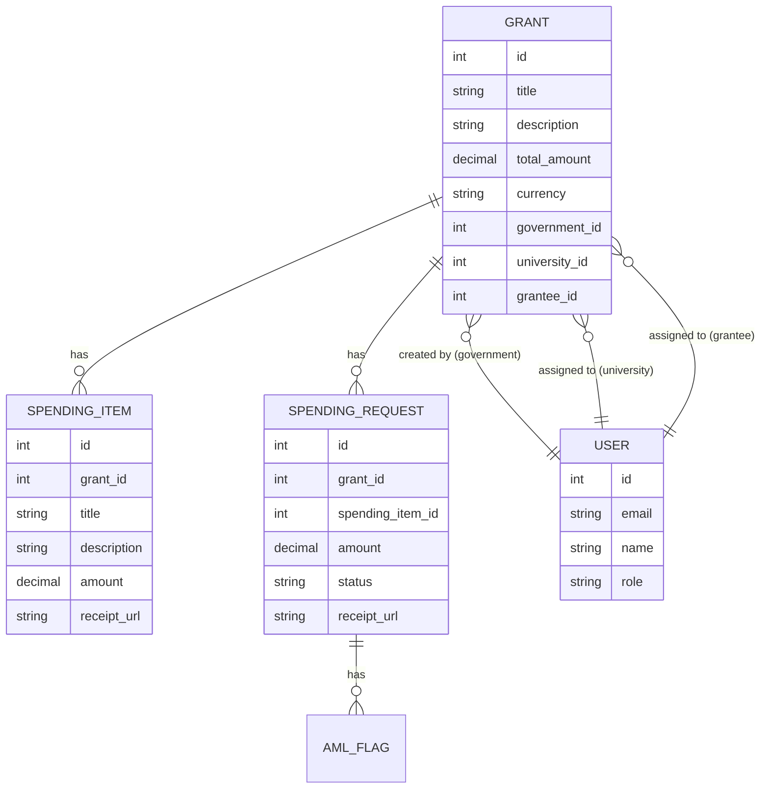

### User Flow

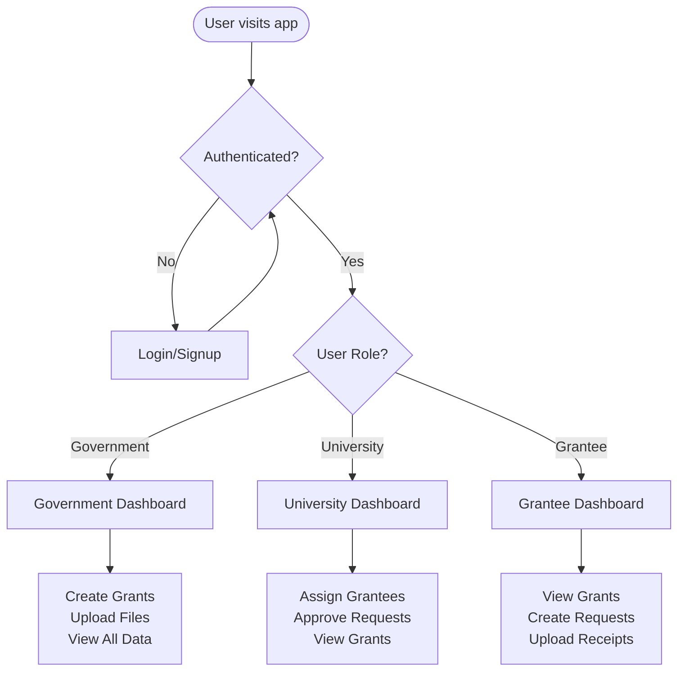

## Использование

### PlantUML
1. Установите PlantUML расширение в VS Code
2. Откройте файл с расширением `.puml` или `.plantuml`
3. Диаграммы будут автоматически рендериться

### Mermaid
1. Используйте в Markdown файлах (GitHub поддерживает)
2. Или используйте онлайн редактор: https://mermaid.live/
3. Или установите расширение Mermaid для VS Code

### Онлайн инструменты
- PlantUML: http://www.plantuml.com/plantuml/uml/
- Mermaid: https://mermaid.live/

